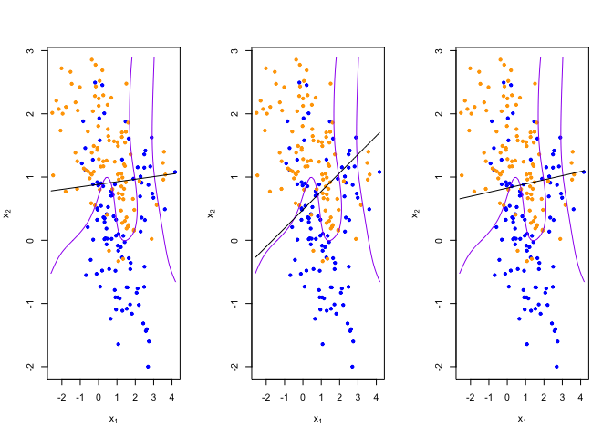
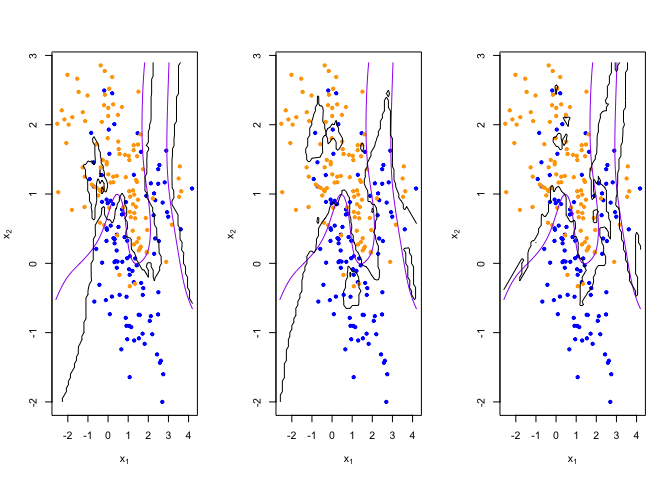
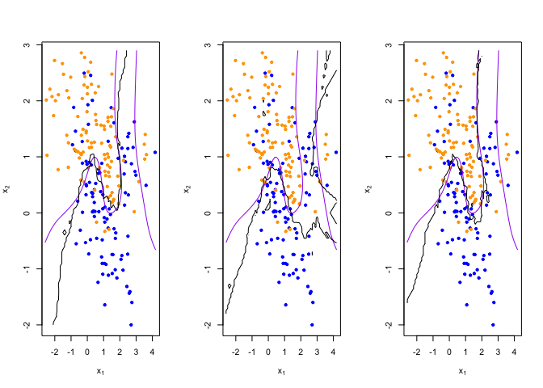

Homework 1
================
Tinglei Wu
1/25/2022

``` r
library('class')
library('dplyr')
```

    ## 
    ## Attaching package: 'dplyr'

    ## The following objects are masked from 'package:stats':
    ## 
    ##     filter, lag

    ## The following objects are masked from 'package:base':
    ## 
    ##     intersect, setdiff, setequal, union

## load binary classification example data from author website

## ‘ElemStatLearn’ package no longer available

``` r
load(url('https://web.stanford.edu/~hastie/ElemStatLearn/datasets/ESL.mixture.rda'))
dat <- ESL.mixture

plot_mix_data <- expression({
  plot(dat$x[,1], dat$x[,2],
       col=ifelse(dat$y==0, 'blue', 'orange'),
       pch=20,
       xlab=expression(x[1]),
       ylab=expression(x[2]))
  ## draw Bayes (True) classification boundary
  prob <- matrix(dat$prob, length(dat$px1), length(dat$px2))
  cont <- contourLines(dat$px1, dat$px2, prob, levels=0.5)
  rslt <- sapply(cont, lines, col='purple')
})

eval(plot_mix_data)
```

<!-- -->

``` r
## fit linear classifier
fit_lc <- function(y, x) {
  x <- cbind(1, x)
  beta <- drop(solve(t(x)%*%x)%*%t(x)%*%y)
}


## make predictions from linear classifier
predict_lc <- function(x, beta) {
  cbind(1, x) %*% beta
}
```

\#\#Question 1

``` r
## using lm to re-write fit_lc

new_lm = lm(dat$y ~ dat$x)
new_lm
```

    ## 
    ## Call:
    ## lm(formula = dat$y ~ dat$x)
    ## 
    ## Coefficients:
    ## (Intercept)       dat$x1       dat$x2  
    ##     0.32906     -0.02264      0.24960

``` r
## using lm to re-write predict_lc
new_predict_lc = predict(new_lm, dat$xnew)
#new_predict_lc


eval(plot_mix_data)
sapply(new_predict_lc, lines)
```

<!-- -->

    ## $`1`
    ## NULL
    ## 
    ## $`2`
    ## NULL
    ## 
    ## $`3`
    ## NULL
    ## 
    ## $`4`
    ## NULL
    ## 
    ## $`5`
    ## NULL
    ## 
    ## $`6`
    ## NULL
    ## 
    ## $`7`
    ## NULL
    ## 
    ## $`8`
    ## NULL
    ## 
    ## $`9`
    ## NULL
    ## 
    ## $`10`
    ## NULL
    ## 
    ## $`11`
    ## NULL
    ## 
    ## $`12`
    ## NULL
    ## 
    ## $`13`
    ## NULL
    ## 
    ## $`14`
    ## NULL
    ## 
    ## $`15`
    ## NULL
    ## 
    ## $`16`
    ## NULL
    ## 
    ## $`17`
    ## NULL
    ## 
    ## $`18`
    ## NULL
    ## 
    ## $`19`
    ## NULL
    ## 
    ## $`20`
    ## NULL
    ## 
    ## $`21`
    ## NULL
    ## 
    ## $`22`
    ## NULL
    ## 
    ## $`23`
    ## NULL
    ## 
    ## $`24`
    ## NULL
    ## 
    ## $`25`
    ## NULL
    ## 
    ## $`26`
    ## NULL
    ## 
    ## $`27`
    ## NULL
    ## 
    ## $`28`
    ## NULL
    ## 
    ## $`29`
    ## NULL
    ## 
    ## $`30`
    ## NULL
    ## 
    ## $`31`
    ## NULL
    ## 
    ## $`32`
    ## NULL
    ## 
    ## $`33`
    ## NULL
    ## 
    ## $`34`
    ## NULL
    ## 
    ## $`35`
    ## NULL
    ## 
    ## $`36`
    ## NULL
    ## 
    ## $`37`
    ## NULL
    ## 
    ## $`38`
    ## NULL
    ## 
    ## $`39`
    ## NULL
    ## 
    ## $`40`
    ## NULL
    ## 
    ## $`41`
    ## NULL
    ## 
    ## $`42`
    ## NULL
    ## 
    ## $`43`
    ## NULL
    ## 
    ## $`44`
    ## NULL
    ## 
    ## $`45`
    ## NULL
    ## 
    ## $`46`
    ## NULL
    ## 
    ## $`47`
    ## NULL
    ## 
    ## $`48`
    ## NULL
    ## 
    ## $`49`
    ## NULL
    ## 
    ## $`50`
    ## NULL
    ## 
    ## $`51`
    ## NULL
    ## 
    ## $`52`
    ## NULL
    ## 
    ## $`53`
    ## NULL
    ## 
    ## $`54`
    ## NULL
    ## 
    ## $`55`
    ## NULL
    ## 
    ## $`56`
    ## NULL
    ## 
    ## $`57`
    ## NULL
    ## 
    ## $`58`
    ## NULL
    ## 
    ## $`59`
    ## NULL
    ## 
    ## $`60`
    ## NULL
    ## 
    ## $`61`
    ## NULL
    ## 
    ## $`62`
    ## NULL
    ## 
    ## $`63`
    ## NULL
    ## 
    ## $`64`
    ## NULL
    ## 
    ## $`65`
    ## NULL
    ## 
    ## $`66`
    ## NULL
    ## 
    ## $`67`
    ## NULL
    ## 
    ## $`68`
    ## NULL
    ## 
    ## $`69`
    ## NULL
    ## 
    ## $`70`
    ## NULL
    ## 
    ## $`71`
    ## NULL
    ## 
    ## $`72`
    ## NULL
    ## 
    ## $`73`
    ## NULL
    ## 
    ## $`74`
    ## NULL
    ## 
    ## $`75`
    ## NULL
    ## 
    ## $`76`
    ## NULL
    ## 
    ## $`77`
    ## NULL
    ## 
    ## $`78`
    ## NULL
    ## 
    ## $`79`
    ## NULL
    ## 
    ## $`80`
    ## NULL
    ## 
    ## $`81`
    ## NULL
    ## 
    ## $`82`
    ## NULL
    ## 
    ## $`83`
    ## NULL
    ## 
    ## $`84`
    ## NULL
    ## 
    ## $`85`
    ## NULL
    ## 
    ## $`86`
    ## NULL
    ## 
    ## $`87`
    ## NULL
    ## 
    ## $`88`
    ## NULL
    ## 
    ## $`89`
    ## NULL
    ## 
    ## $`90`
    ## NULL
    ## 
    ## $`91`
    ## NULL
    ## 
    ## $`92`
    ## NULL
    ## 
    ## $`93`
    ## NULL
    ## 
    ## $`94`
    ## NULL
    ## 
    ## $`95`
    ## NULL
    ## 
    ## $`96`
    ## NULL
    ## 
    ## $`97`
    ## NULL
    ## 
    ## $`98`
    ## NULL
    ## 
    ## $`99`
    ## NULL
    ## 
    ## $`100`
    ## NULL
    ## 
    ## $`101`
    ## NULL
    ## 
    ## $`102`
    ## NULL
    ## 
    ## $`103`
    ## NULL
    ## 
    ## $`104`
    ## NULL
    ## 
    ## $`105`
    ## NULL
    ## 
    ## $`106`
    ## NULL
    ## 
    ## $`107`
    ## NULL
    ## 
    ## $`108`
    ## NULL
    ## 
    ## $`109`
    ## NULL
    ## 
    ## $`110`
    ## NULL
    ## 
    ## $`111`
    ## NULL
    ## 
    ## $`112`
    ## NULL
    ## 
    ## $`113`
    ## NULL
    ## 
    ## $`114`
    ## NULL
    ## 
    ## $`115`
    ## NULL
    ## 
    ## $`116`
    ## NULL
    ## 
    ## $`117`
    ## NULL
    ## 
    ## $`118`
    ## NULL
    ## 
    ## $`119`
    ## NULL
    ## 
    ## $`120`
    ## NULL
    ## 
    ## $`121`
    ## NULL
    ## 
    ## $`122`
    ## NULL
    ## 
    ## $`123`
    ## NULL
    ## 
    ## $`124`
    ## NULL
    ## 
    ## $`125`
    ## NULL
    ## 
    ## $`126`
    ## NULL
    ## 
    ## $`127`
    ## NULL
    ## 
    ## $`128`
    ## NULL
    ## 
    ## $`129`
    ## NULL
    ## 
    ## $`130`
    ## NULL
    ## 
    ## $`131`
    ## NULL
    ## 
    ## $`132`
    ## NULL
    ## 
    ## $`133`
    ## NULL
    ## 
    ## $`134`
    ## NULL
    ## 
    ## $`135`
    ## NULL
    ## 
    ## $`136`
    ## NULL
    ## 
    ## $`137`
    ## NULL
    ## 
    ## $`138`
    ## NULL
    ## 
    ## $`139`
    ## NULL
    ## 
    ## $`140`
    ## NULL
    ## 
    ## $`141`
    ## NULL
    ## 
    ## $`142`
    ## NULL
    ## 
    ## $`143`
    ## NULL
    ## 
    ## $`144`
    ## NULL
    ## 
    ## $`145`
    ## NULL
    ## 
    ## $`146`
    ## NULL
    ## 
    ## $`147`
    ## NULL
    ## 
    ## $`148`
    ## NULL
    ## 
    ## $`149`
    ## NULL
    ## 
    ## $`150`
    ## NULL
    ## 
    ## $`151`
    ## NULL
    ## 
    ## $`152`
    ## NULL
    ## 
    ## $`153`
    ## NULL
    ## 
    ## $`154`
    ## NULL
    ## 
    ## $`155`
    ## NULL
    ## 
    ## $`156`
    ## NULL
    ## 
    ## $`157`
    ## NULL
    ## 
    ## $`158`
    ## NULL
    ## 
    ## $`159`
    ## NULL
    ## 
    ## $`160`
    ## NULL
    ## 
    ## $`161`
    ## NULL
    ## 
    ## $`162`
    ## NULL
    ## 
    ## $`163`
    ## NULL
    ## 
    ## $`164`
    ## NULL
    ## 
    ## $`165`
    ## NULL
    ## 
    ## $`166`
    ## NULL
    ## 
    ## $`167`
    ## NULL
    ## 
    ## $`168`
    ## NULL
    ## 
    ## $`169`
    ## NULL
    ## 
    ## $`170`
    ## NULL
    ## 
    ## $`171`
    ## NULL
    ## 
    ## $`172`
    ## NULL
    ## 
    ## $`173`
    ## NULL
    ## 
    ## $`174`
    ## NULL
    ## 
    ## $`175`
    ## NULL
    ## 
    ## $`176`
    ## NULL
    ## 
    ## $`177`
    ## NULL
    ## 
    ## $`178`
    ## NULL
    ## 
    ## $`179`
    ## NULL
    ## 
    ## $`180`
    ## NULL
    ## 
    ## $`181`
    ## NULL
    ## 
    ## $`182`
    ## NULL
    ## 
    ## $`183`
    ## NULL
    ## 
    ## $`184`
    ## NULL
    ## 
    ## $`185`
    ## NULL
    ## 
    ## $`186`
    ## NULL
    ## 
    ## $`187`
    ## NULL
    ## 
    ## $`188`
    ## NULL
    ## 
    ## $`189`
    ## NULL
    ## 
    ## $`190`
    ## NULL
    ## 
    ## $`191`
    ## NULL
    ## 
    ## $`192`
    ## NULL
    ## 
    ## $`193`
    ## NULL
    ## 
    ## $`194`
    ## NULL
    ## 
    ## $`195`
    ## NULL
    ## 
    ## $`196`
    ## NULL
    ## 
    ## $`197`
    ## NULL
    ## 
    ## $`198`
    ## NULL
    ## 
    ## $`199`
    ## NULL
    ## 
    ## $`200`
    ## NULL

## Question 2

``` r
## add square term for x1 and x2
fit_lc_sqr <- function(y, x) {
  x <- cbind(1, x, x[,1]^2, x[,2]^2)
  beta <- drop(solve(t(x)%*%x)%*%t(x)%*%y)
}

predict_lc_sqr <- function(x, beta) {
  cbind(1, x, x[,1]^2, x[,2]^2) %*% beta
}
#lc_count1 = contourLines(dat$px1, dat$px2, predict_lc_sqr, levels = 0.5)
#eval(plot_mix_data)
#sapply(lc_count1, lines)
```

## Question 3

``` r
## Compare the bias-variance trade-off
lc_beta <- fit_lc(dat$y, dat$x)
lc_pred <- predict_lc(dat$xnew, lc_beta)

## reshape predictions as a matrix
lc_pred <- matrix(lc_pred, length(dat$px1), length(dat$px2))
contour(lc_pred,
      xlab=expression(x[1]),
      ylab=expression(x[2]))
```

<!-- -->

``` r
## More flexible model
lc_new_beta = fit_lc_sqr(dat$y, dat$x)
lc_new_pred = predict_lc_sqr(dat$xnew, lc_new_beta)
lc_new_pred <- matrix(lc_new_pred, length(dat$px1), length(dat$px2))
contour(lc_new_pred,
      xlab=expression(x[1]),
      ylab=expression(x[2]))
```

<!-- -->

``` r
lc_count = contourLines(dat$px1, dat$px2, lc_new_pred, levels = 0.5)
eval(plot_mix_data)
sapply(lc_count, lines)
```

<!-- -->

    ## [[1]]
    ## NULL

-   In this case, bias is defined to be the error between the prediction
    made by model and the target value or the ground truth. On the other
    hand, variance describes how much a random variable differs from its
    expected value. In this case, by adding the squared terms, the bias
    reduced and variance increases. This is due to the fact that as a
    statistical method tries to match data points more closely or when a
    more flexible method is used, the bias would reduce and variance
    would increases as shown in the graph above.

``` r
## fit model to mixture data and make predictions
lc_beta <- fit_lc(dat$y, dat$x)
lc_pred <- predict_lc(dat$xnew, lc_beta)

## reshape predictions as a matrix
lc_pred <- matrix(lc_pred, length(dat$px1), length(dat$px2))
contour(lc_pred,
      xlab=expression(x[1]),
      ylab=expression(x[2]))
```

<!-- -->

``` r
## find the contours in 2D space such that lc_pred == 0.5
lc_cont <- contourLines(dat$px1, dat$px2, lc_pred, levels=0.5)

## plot data and decision surface
eval(plot_mix_data)
sapply(lc_cont, lines)
```

<!-- -->

    ## [[1]]
    ## NULL

``` r
## fit knn classifier
## use 5-NN to estimate probability of class assignment
knn_fit <- knn(train=dat$x, test=dat$xnew, cl=dat$y, k=5, prob=TRUE)
knn_pred <- attr(knn_fit, 'prob')
knn_pred <- ifelse(knn_fit == 1, knn_pred, 1-knn_pred)

## reshape predictions as a matrix
knn_pred <- matrix(knn_pred, length(dat$px1), length(dat$px2))
contour(knn_pred,
        xlab=expression(x[1]),
        ylab=expression(x[2]),
        levels=c(0.2, 0.5, 0.8))
```

<!-- -->

``` r
## find the contours in 2D space such that knn_pred == 0.5
knn_cont <- contourLines(dat$px1, dat$px2, knn_pred, levels=0.5)

## plot data and decision surface
eval(plot_mix_data)
sapply(knn_cont, lines)
```

<!-- -->

    ## [[1]]
    ## NULL
    ## 
    ## [[2]]
    ## NULL
    ## 
    ## [[3]]
    ## NULL
    ## 
    ## [[4]]
    ## NULL
    ## 
    ## [[5]]
    ## NULL

``` r
## do bootstrap to get a sense of variance in decision surface
resample <- function(dat) {
  idx <- sample(1:length(dat$y), replace = T)
  dat$y <- dat$y[idx]
  dat$x <- dat$x[idx,]
  return(dat)
}
  
## plot linear classifier for three bootstraps
par(mfrow=c(1,3))
for(b in 1:3) {
  datb <- resample(dat)
  ## fit model to mixture data and make predictions
  lc_beta <- fit_lc(datb$y, datb$x)
  lc_pred <- predict_lc(datb$xnew, lc_beta)
  
  ## reshape predictions as a matrix
  lc_pred <- matrix(lc_pred, length(datb$px1), length(datb$px2))

  ## find the contours in 2D space such that lc_pred == 0.5
  lc_cont <- contourLines(datb$px1, datb$px2, lc_pred, levels=0.5)
  
  ## plot data and decision surface
  eval(plot_mix_data)
  sapply(lc_cont, lines)
}
```

<!-- -->

``` r
## plot 5-NN classifier for three bootstraps
par(mfrow=c(1,3))
for(b in 1:3) {
  datb <- resample(dat)
  
  knn_fit <- knn(train=datb$x, test=datb$xnew, cl=datb$y, k=5, prob=TRUE)
  knn_pred <- attr(knn_fit, 'prob')
  knn_pred <- ifelse(knn_fit == 1, knn_pred, 1-knn_pred)
  
  ## reshape predictions as a matrix
  knn_pred <- matrix(knn_pred, length(datb$px1), length(datb$px2))

  ## find the contours in 2D space such that knn_pred == 0.5
  knn_cont <- contourLines(datb$px1, datb$px2, knn_pred, levels=0.5)
  
  ## plot data and decision surface
  eval(plot_mix_data)
  sapply(knn_cont, lines)
}
```

<!-- -->

``` r
## plot 20-NN classifier for three bootstraps
par(mfrow=c(1,3))
for(b in 1:3) {
  datb <- resample(dat)
  
  knn_fit <- knn(train=datb$x, test=datb$xnew, cl=datb$y, k=20, prob=TRUE)
  knn_pred <- attr(knn_fit, 'prob')
  knn_pred <- ifelse(knn_fit == 1, knn_pred, 1-knn_pred)
  
  ## reshape predictions as a matrix
  knn_pred <- matrix(knn_pred, length(datb$px1), length(datb$px2))
  
  ## find the contours in 2D space such that knn_pred == 0.5
  knn_cont <- contourLines(datb$px1, datb$px2, knn_pred, levels=0.5)
  
  ## plot data and decision surface
  eval(plot_mix_data)
  sapply(knn_cont, lines)
}
```

<!-- -->
