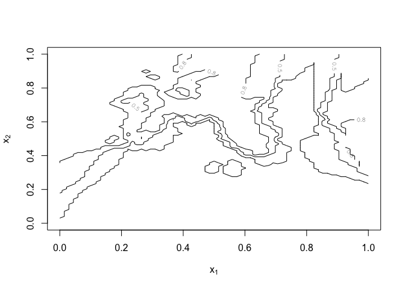
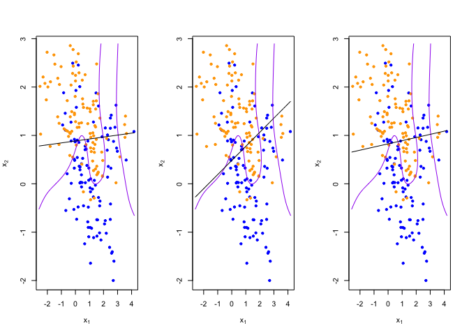

Homework 1
================
Tinglei Wu
1/25/2022

``` r
library('class')
library('dplyr')
```

    ## 
    ## Attaching package: 'dplyr'

    ## The following objects are masked from 'package:stats':
    ## 
    ##     filter, lag

    ## The following objects are masked from 'package:base':
    ## 
    ##     intersect, setdiff, setequal, union

``` r
?lm
```

## load binary classification example data from author website

## ‘ElemStatLearn’ package no longer available

``` r
load(url('https://web.stanford.edu/~hastie/ElemStatLearn/datasets/ESL.mixture.rda'))
dat <- ESL.mixture

plot_mix_data <- expression({
  plot(dat$x[,1], dat$x[,2],
       col=ifelse(dat$y==0, 'blue', 'orange'),
       pch=20,
       xlab=expression(x[1]),
       ylab=expression(x[2]))
  ## draw Bayes (True) classification boundary
  prob <- matrix(dat$prob, length(dat$px1), length(dat$px2))
  cont <- contourLines(dat$px1, dat$px2, prob, levels=0.5)
  rslt <- sapply(cont, lines, col='purple')
})

eval(plot_mix_data)
```

<!-- -->

``` r
## fit linear classifier
fit_lc <- function(y, x) {
  x <- cbind(1, x)
  beta <- drop(solve(t(x)%*%x)%*%t(x)%*%y)
}


## make predictions from linear classifier
predict_lc <- function(x, beta) {
  cbind(1, x) %*% beta
}
```

\#\#Question 1

``` r
## using lm to re-write fit_lc

new_lm = lm(dat$y ~ dat$x)
new_lm
```

    ## 
    ## Call:
    ## lm(formula = dat$y ~ dat$x)
    ## 
    ## Coefficients:
    ## (Intercept)       dat$x1       dat$x2  
    ##     0.32906     -0.02264      0.24960

``` r
## using lm to re-write predict_lc
new_predict_lc = predict(new_lm, dat$xnew)
new_predict_lc
```

    ##            1            2            3            4            5            6 
    ##  0.352014422  0.328607909  0.490755353  0.507351134  0.545975518  0.023997800 
    ##            7            8            9           10           11           12 
    ##  0.199090187  0.653285061  0.168073496  0.529152617  0.338161631  0.206799008 
    ##           13           14           15           16           17           18 
    ##  0.559293198  0.451102028  0.489464524  0.232447834  0.654071856  0.556856350 
    ##           19           20           21           22           23           24 
    ##  0.326111654  0.422403051 -0.054073470  0.261458584  0.536967529 -0.231078642 
    ##           25           26           27           28           29           30 
    ##  0.764495447  0.284241502  0.810096274  0.176192233  0.073463628  0.568999020 
    ##           31           32           33           34           35           36 
    ##  0.429239783 -0.105296030  0.330207722  0.413568442  0.618734589  0.461944898 
    ##           37           38           39           40           41           42 
    ##  0.611783969  0.405133297  0.024270801  0.318629818  0.109219489  0.529503779 
    ##           43           44           45           46           47           48 
    ##  0.107430771  0.365506020  0.955810858  0.200131561  0.817763505  0.325937547 
    ##           49           50           51           52           53           54 
    ##  0.083265549  0.316117058  0.447167355  0.393619447  0.074902706  0.557105881 
    ##           55           56           57           58           59           60 
    ##  0.205039832  0.709274419  0.551077094  0.456884500  0.486509647  0.504177111 
    ##           61           62           63           64           65           66 
    ##  0.408546470  0.936903040  0.693422953  0.411560984 -0.132453997  0.823215383 
    ##           67           68           69           70           71           72 
    ##  0.311516258  0.004213304  0.448448472  0.088859505  0.079692948  0.036961250 
    ##           73           74           75           76           77           78 
    ##  0.274413951  0.263559991  0.112703429  0.033996298  0.365580723  0.090801748 
    ##           79           80           81           82           83           84 
    ##  0.144035856  0.529175135  0.324753595  0.369746777 -0.087611903 -0.002033325 
    ##           85           86           87           88           89           90 
    ##  0.669390270  0.188021575  0.560294410  0.202580024  0.394142658 -0.081348569 
    ##           91           92           93           94           95           96 
    ##  0.722126324  0.221018354  0.625282347  0.289504178  0.621778464  0.303115631 
    ##           97           98           99          100          101          102 
    ##  0.503387434  0.450964409  0.388848047  0.021760695  0.450089916  0.506089207 
    ##          103          104          105          106          107          108 
    ##  0.488785032  0.903083909  0.222132439  0.484358707  0.596722393  0.756817840 
    ##          109          110          111          112          113          114 
    ##  0.480765762  0.563656893  0.723450326  0.544291070  0.876303339  0.489888868 
    ##          115          116          117          118          119          120 
    ##  0.809151939  1.053732663  0.460643257  0.728325923  0.628435531  0.513964643 
    ##          121          122          123          124          125          126 
    ##  0.939822345  0.703154069  0.225363701  0.418851415  0.979703013  0.352442487 
    ##          127          128          129          130          131          132 
    ##  0.896305740  0.852648187  0.867135171  0.932197215  0.780104640  1.028736082 
    ##          133          134          135          136          137          138 
    ##  0.695224458  0.619354645  0.649026189  0.634081552  0.707938856  0.373139243 
    ##          139          140          141          142          143          144 
    ##  1.025536910  0.687095285  0.845570670  0.512291965  0.895638096  0.564932476 
    ##          145          146          147          148          149          150 
    ##  0.630728359  0.676963622  0.527711091  0.617161710  0.641354472  0.682158692 
    ##          151          152          153          154          155          156 
    ##  0.692904513  0.771274572  0.873209940  0.268854775  0.500670359  0.562345044 
    ##          157          158          159          160          161          162 
    ##  0.396386790  0.584476114  0.756161832  0.346756641  0.597516023  0.274771880 
    ##          163          164          165          166          167          168 
    ##  1.050247913  0.323107016  0.614114218  0.555268474  0.913333373  0.683019162 
    ##          169          170          171          172          173          174 
    ##  0.341066648  0.956592252  0.709968251  0.859490724  0.469769301  0.405101557 
    ##          175          176          177          178          179          180 
    ##  0.513630623  0.602554484  0.605742042  0.367956027  0.589770776  0.902013419 
    ##          181          182          183          184          185          186 
    ##  0.725657598  0.615245232  0.384981551  0.700771344  0.707413333  0.619727547 
    ##          187          188          189          190          191          192 
    ##  0.524595024  0.635276128  0.597648663  0.667621940  0.956696851  0.558444108 
    ##          193          194          195          196          197          198 
    ##  0.995470203  0.889071631  0.419601494  0.895729502  0.326680044  0.547242044 
    ##          199          200 
    ##  0.888542712  0.471133048

## Question 2

``` r
## add square term for x1 and x2
fit_lc_sqr <- function(y, x) {
  x <- cbind(1, x, x[,1]^2, x[,2]^2)
  beta <- drop(solve(t(x)%*%x)%*%t(x)%*%y)
}

predict_lc_sqr <- function(x, beta) {
  cbind(1, x, x[,1]^2, x[,2]^2) %*% beta
}
```

## Question 3

``` r
## Compare the bias-variance trade-off
lc_beta <- fit_lc(dat$y, dat$x)
lc_pred <- predict_lc(dat$xnew, lc_beta)

## reshape predictions as a matrix
lc_pred <- matrix(lc_pred, length(dat$px1), length(dat$px2))
contour(lc_pred,
      xlab=expression(x[1]),
      ylab=expression(x[2]))
```

<!-- -->

``` r
## More flexible model
lc_new_beta = fit_lc_sqr(dat$y, dat$x)
lc_new_pred = predict_lc_sqr(dat$xnew, lc_new_beta)
lc_new_pred <- matrix(lc_new_pred, length(dat$px1), length(dat$px2))
contour(lc_new_pred,
      xlab=expression(x[1]),
      ylab=expression(x[2]))
```

<!-- -->

-   Based on the second graph above, we can see that the variance has
    increased from the original graph, and the bias has decreased. This
    is the bias-variance trad-off after adding the squared terms for x1
    and x2.

``` r
## fit model to mixture data and make predictions
lc_beta <- fit_lc(dat$y, dat$x)
lc_pred <- predict_lc(dat$xnew, lc_beta)

## reshape predictions as a matrix
lc_pred <- matrix(lc_pred, length(dat$px1), length(dat$px2))
contour(lc_pred,
      xlab=expression(x[1]),
      ylab=expression(x[2]))
```

<!-- -->

``` r
## find the contours in 2D space such that lc_pred == 0.5
lc_cont <- contourLines(dat$px1, dat$px2, lc_pred, levels=0.5)

## plot data and decision surface
eval(plot_mix_data)
sapply(lc_cont, lines)
```

<!-- -->

    ## [[1]]
    ## NULL

``` r
## fit knn classifier
## use 5-NN to estimate probability of class assignment
knn_fit <- knn(train=dat$x, test=dat$xnew, cl=dat$y, k=5, prob=TRUE)
knn_pred <- attr(knn_fit, 'prob')
knn_pred <- ifelse(knn_fit == 1, knn_pred, 1-knn_pred)

## reshape predictions as a matrix
knn_pred <- matrix(knn_pred, length(dat$px1), length(dat$px2))
contour(knn_pred,
        xlab=expression(x[1]),
        ylab=expression(x[2]),
        levels=c(0.2, 0.5, 0.8))
```

<!-- -->

``` r
## find the contours in 2D space such that knn_pred == 0.5
knn_cont <- contourLines(dat$px1, dat$px2, knn_pred, levels=0.5)

## plot data and decision surface
eval(plot_mix_data)
sapply(knn_cont, lines)
```

<!-- -->

    ## [[1]]
    ## NULL
    ## 
    ## [[2]]
    ## NULL
    ## 
    ## [[3]]
    ## NULL
    ## 
    ## [[4]]
    ## NULL
    ## 
    ## [[5]]
    ## NULL

``` r
## do bootstrap to get a sense of variance in decision surface
resample <- function(dat) {
  idx <- sample(1:length(dat$y), replace = T)
  dat$y <- dat$y[idx]
  dat$x <- dat$x[idx,]
  return(dat)
}
  
## plot linear classifier for three bootstraps
par(mfrow=c(1,3))
for(b in 1:3) {
  datb <- resample(dat)
  ## fit model to mixture data and make predictions
  lc_beta <- fit_lc(datb$y, datb$x)
  lc_pred <- predict_lc(datb$xnew, lc_beta)
  
  ## reshape predictions as a matrix
  lc_pred <- matrix(lc_pred, length(datb$px1), length(datb$px2))

  ## find the contours in 2D space such that lc_pred == 0.5
  lc_cont <- contourLines(datb$px1, datb$px2, lc_pred, levels=0.5)
  
  ## plot data and decision surface
  eval(plot_mix_data)
  sapply(lc_cont, lines)
}
```

<!-- -->

``` r
## plot 5-NN classifier for three bootstraps
par(mfrow=c(1,3))
for(b in 1:3) {
  datb <- resample(dat)
  
  knn_fit <- knn(train=datb$x, test=datb$xnew, cl=datb$y, k=5, prob=TRUE)
  knn_pred <- attr(knn_fit, 'prob')
  knn_pred <- ifelse(knn_fit == 1, knn_pred, 1-knn_pred)
  
  ## reshape predictions as a matrix
  knn_pred <- matrix(knn_pred, length(datb$px1), length(datb$px2))

  ## find the contours in 2D space such that knn_pred == 0.5
  knn_cont <- contourLines(datb$px1, datb$px2, knn_pred, levels=0.5)
  
  ## plot data and decision surface
  eval(plot_mix_data)
  sapply(knn_cont, lines)
}
```

<!-- -->

``` r
## plot 20-NN classifier for three bootstraps
par(mfrow=c(1,3))
for(b in 1:3) {
  datb <- resample(dat)
  
  knn_fit <- knn(train=datb$x, test=datb$xnew, cl=datb$y, k=20, prob=TRUE)
  knn_pred <- attr(knn_fit, 'prob')
  knn_pred <- ifelse(knn_fit == 1, knn_pred, 1-knn_pred)
  
  ## reshape predictions as a matrix
  knn_pred <- matrix(knn_pred, length(datb$px1), length(datb$px2))
  
  ## find the contours in 2D space such that knn_pred == 0.5
  knn_cont <- contourLines(datb$px1, datb$px2, knn_pred, levels=0.5)
  
  ## plot data and decision surface
  eval(plot_mix_data)
  sapply(knn_cont, lines)
}
```

<!-- -->
